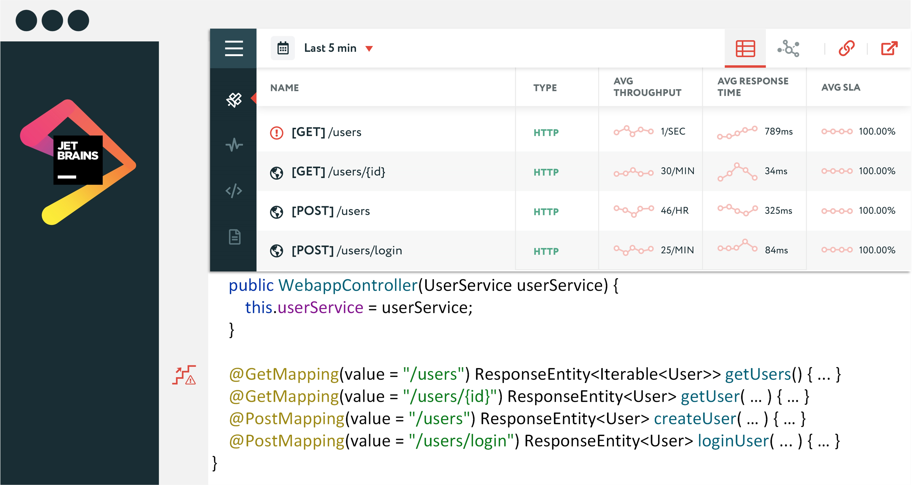

## Description

<!-- Plugin description -->
SourceMarker is a JetBrains-based plugin which implements Feedback-Driven Development (continuous feedback) technology
via integration with [Apache SkyWalking](https://github.com/apache/skywalking).
<!-- Plugin description end -->

## Features

todo

## Installation

- Using IDE built-in plugin system:
  
  <kbd>Preferences</kbd> > <kbd>Plugins</kbd> > <kbd>Marketplace</kbd> > <kbd>Search for "SourceMarker"</kbd> >
  <kbd>Install Plugin</kbd>
  
- Manually:

  Download the [latest release](https://github.com/sourceplusplus/SourceMarker-Plugin/releases/latest) and install it manually using
  <kbd>Preferences</kbd> > <kbd>Plugins</kbd> > <kbd>⚙️</kbd> > <kbd>Install plugin from disk...</kbd>

## Usage

todo

# Development

## Project Structure

### Framework

| Module                        | Description                                                          | Version |
| ----------------------------- | -------------------------------------------------------------------- | ------- |
| :mapper                       | Tracks source code artifact refactoring                              | 0.0.1   |
| :marker                       | Used to tie visual marks & popups to source code artifacts           | 0.0.1   |
| :mentor                       | Produces source code artifact informative/cautionary advice          | 0.0.1   |
| :portal                       | Used to visually display contextualized artifact data/advice         | 0.0.1   |
| :protocol                     | Common data models and communication clients                         | 0.0.1   |

### Implementation

| Module                        | Description                                                          | Version |
| ----------------------------- | -------------------------------------------------------------------- | ------- |
| :monitor:skywalking           | Apache SkyWalking monitor implementation                             | 0.0.1   |
| :plugin:jetbrains             | JetBrains plugin implementation                                      | 0.0.1   |

# Todo

- [ ] Set the Plugin ID in the above README badges.
- [ ] Set the [Deployment Token](https://plugins.jetbrains.com/docs/marketplace/plugin-upload.html).
- [ ] https://github.com/apollographql/apollo-android